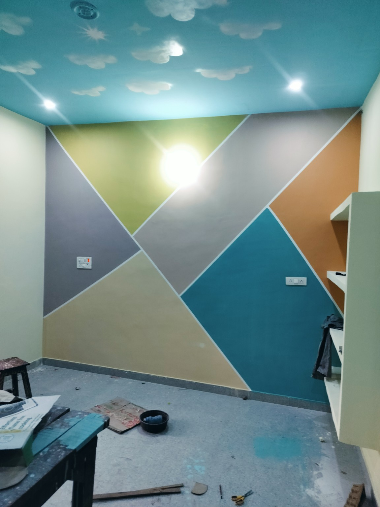
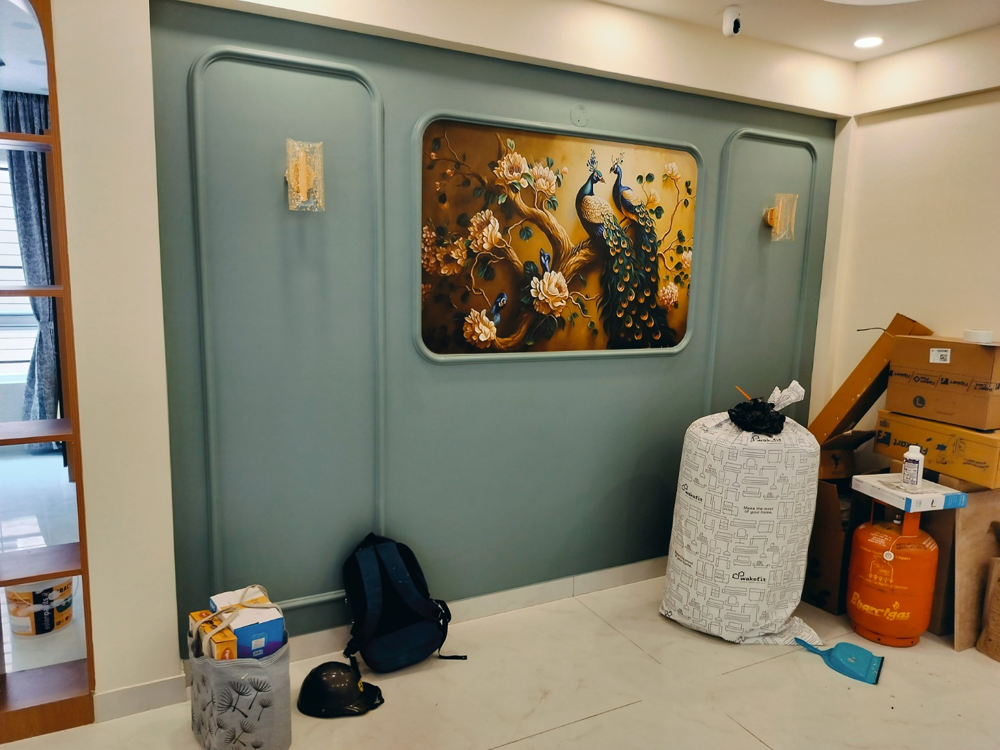
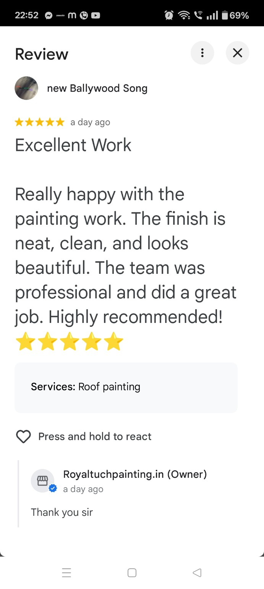
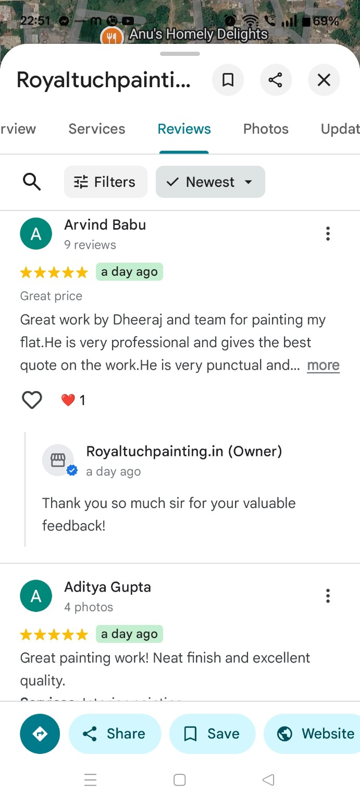
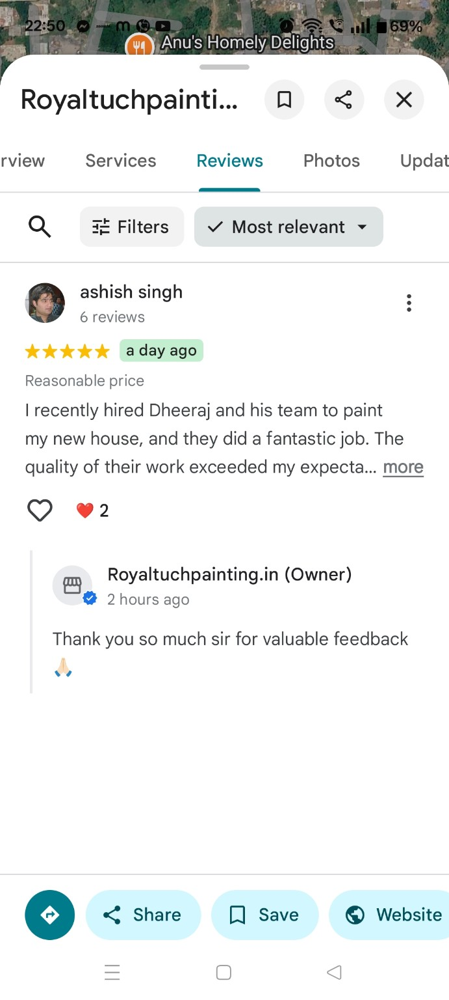

 https://github.com/dg2488239-cloud/Royaltuchpainting.in/blob/564cc0191bcd5448676ed0b76cca393f93ae0170/IMG_6962.png   index.html
<!DOCTYPE html>

<html>

<head>

<meta charset="UTF-8">

<title>Royal Tuch Painting</title>

</head>

<body>

<h1>Royal Tuch Painting</h1>

Professional House Painting Service

<h2>Services</h2>

<ul>

<li>Interior Painting</li>

<li>Exterior Painting</li>

<li>Wall Putty</li>

<li>Texture Painting</li>

<li>Royale Play</li>

<li>Waterproofing</li>

<li>Wood Polish</li>

<li>Metal Painting</li>

<li>Apartment Painting</li>

<li>Villa Painting</li>

</ul>

</body>

</html>
Updated website
<h2>Our Recent Projects</h2>
<h2>Contact Us</h2> 
src="GOOGLE_MAPS_LINK"
from pathlib import Path

html = r'''<!DOCTYPE html>
<html lang="en">
<head>
  <meta charset="UTF-8">
  <meta name="viewport" content="width=device-width, initial-scale=1.0">
  <meta name="description" content="Royal Tuch Painting Services Bangalore - Interior, Exterior, Texture, Waterproofing and Premium Painting Solutions.">
  <meta name="keywords" content="painting services Bangalore, house painting Bangalore, interior painting, exterior painting, texture painting, waterproofing">
  <meta name="theme-color" content="#0b1f3a">
  <title>Royal Tuch Painting Services Bangalore</title>
  <link rel="stylesheet" href="style.css">
</head>

<body>

  <header>
    

      

      <nav>
        <a href="#home">Home</a>
        <a href="#services">Services</a>
        <a href="#projects">Projects</a>
        <a href="#reviews">Reviews</a>
        <a href="#quote">Get Quote</a>
      </nav>
    

  </header>

  <main>

    <section id="home" class="hero">
      

        

          
Bangalore Professional Painting Service

          <h1>Professional House Painting Service</h1>
          
Interior, Exterior, Texture, Waterproofing &amp; Premium Painting Solutions.

          

            <a class="btn" href="#quote">Get Free Quote</a>
            <a class="btn" href="tel:8009503341">Call Now</a>
            <a class="btn" href="https://wa.me/919035376925" target="_blank" rel="noopener">WhatsApp</a>
          

          

            500+ Projects
            10+ Years Experience
            Professional Focus
          

        

      

    </section>

    <section id="services" class="section">
      

        <h2>Our Painting Services</h2>
        
Complete painting solutions for homes, apartments, villas and commercial spaces in Bangalore.

        

          <article class="card">
            <h3>Interior Painting</h3>
            
Premium interior painting, repainting, putty, primer and washable emulsion finishes.

          </article>

          <article class="card">
            <h3>Exterior Painting</h3>
            
Exterior wall preparation and durable weather-resistant painting solutions.

          </article>

          <article class="card">
            <h3>Texture &amp; Designer Walls</h3>
            
Modern texture, feature walls, Royale Play and designer decorative finishes.

          </article>

          <article class="card">
            <h3>Waterproofing</h3>
            
Terrace, wall and damp-area waterproofing solutions with proper surface preparation.

          </article>

          <article class="card">
            <h3>Commercial Painting</h3>
            
Painting services for offices, shops, apartments and other commercial properties.

          </article>

          <article class="card">
            <h3>House Repainting</h3>
            
Complete repainting with crack repair, masking, cleaning and professional finishing.

          </article>
        

      

    </section>

    <section class="section calculator-section">
      

        <h2>Quick Painting Estimate</h2>
        
Enter your approximate area to get a quick labour-and-material estimate.

        

          <label for="calcArea">Area in sq.ft.</label>
          <input id="calcArea" type="number" min="1" placeholder="Example: 1000">

          <label for="calcType">Painting type</label>
          <select id="calcType">
            <option value="12">Standard Interior - ₹12/sq.ft.</option>
            <option value="18">Premium Interior - ₹18/sq.ft.</option>
            <option value="22">Exterior Painting - ₹22/sq.ft.</option>
            <option value="30">Texture / Designer - ₹30/sq.ft.</option>
          </select>

          
Estimated Amount: ₹0

          <a class="btn" href="#quote">Get Exact Site Quote</a>
        

      

    </section>

    <section id="projects" class="section">
      

        <h2>Our Recent Projects</h2>
        
A few examples of our painting and decorative wall work.

        

          <figure>
            
            <figcaption>Geometric Feature Wall</figcaption>
          </figure>

          <figure>
            
            <figcaption>Premium Feature Wall</figcaption>
          </figure>

          <figure>
            
            <figcaption>Royal Tuch Painting Work</figcaption>
          </figure>
        

      

    </section>

    <section id="reviews" class="section">
      

        <h2>Customer Reviews</h2>

        

          <article class="review-card">
            
            <h3>Excellent Work</h3>
            
Professional finishing and good quality work.

          </article>

          <article class="review-card">
            
            <h3>Arvind</h3>
            
Good service and professional painting work.

          </article>

          <article class="review-card">
            
            <h3>Ashish</h3>
            
Very good painting work and finishing.

          </article>
        

      

    </section>

    <section id="quote" class="section quote-section">
      

        <h2>Get a Free Painting Quote</h2>
        
Send your details on WhatsApp and we will contact you for a site visit and quotation.

        <form id="quoteForm">
          <label for="name">Name</label>
          <input id="name" name="name" type="text" placeholder="Your name" required>

          <label for="phone">Mobile Number</label>
          <input id="phone" name="phone" type="tel" inputmode="numeric" maxlength="10" placeholder="10-digit mobile number" required>

          <label for="location">Location</label>
          <input id="location" name="location" type="text" placeholder="Your Bangalore location" required>

          <label for="service">Service Required</label>
          <select id="service" name="service" required>
            <option value="">Select service</option>
            <option>Interior Painting</option>
            <option>Exterior Painting</option>
            <option>House Repainting</option>
            <option>Texture / Designer Wall</option>
            <option>Waterproofing</option>
            <option>Commercial Painting</option>
          </select>

          <label for="area">Approx. Area (sq.ft.)</label>
          <input id="area" name="area" type="number" min="1" placeholder="Example: 1200">

          <button class="btn" type="submit">Send Quote Request on WhatsApp</button>
        </form>
      

    </section>

    <section class="section faq-section">
      

        <h2>Frequently Asked Questions</h2>

        

          
Do you provide a site visit?

          
Yes. Contact us to discuss your requirement and arrange a site visit.

        

        

          
Do you provide labour and material?

          
Yes, quotation options can be provided according to your project requirement.

        

        

          
Do you work across Bangalore?

          
Yes, we provide painting services in Bangalore and nearby areas.

        

      

    </section>

    <section class="cta">
      

        <h2>Need Professional Painting Work?</h2>
        
Call or WhatsApp Royal Tuch Painting Services Bangalore today.

        

          <a class="btn" href="tel:8009503341">8009503341</a>
          <a class="btn" href="https://wa.me/919035376925" target="_blank" rel="noopener">WhatsApp Us</a>
        

      

    </section>

  </main>

  <footer>
    

      
      
© 2026 Royal Tuch Painting Services Bangalore. All rights reserved.

      
Interior • Exterior • Texture • Waterproofing • Premium Painting

    

  </footer>

  

</body>
</html>
'''

path = Path("/mnt/data/index.html")
path.write_text(html, encoding="utf-8")
print(f"Created: {path}")
print(f"Size: {path.stat().st_size} bytes")
